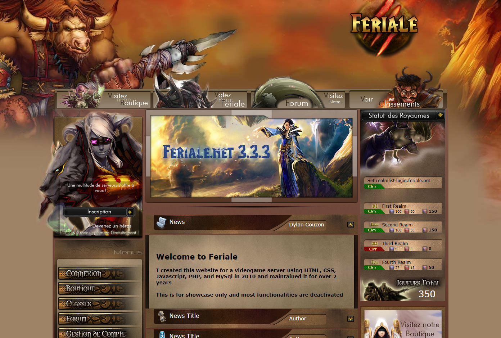

# Feriale
2010-2012

Please checkout the [demo!](http://feriale-env.eba-pvgra8uq.us-west-2.elasticbeanstalk.com/)

## Technologies Used
- HTML
- CSS
- JavaScript
- PHP
- [jQuery](https://jquery.com/)
- [MySQL](https://www.mysql.com/)

 

## Summary 
This App was the main website for a French game server that I created in 2010.

The users were able to create an account, join the game, interact with the community and manage their account/online characters.

 

## Author
- [dylancouzon@gmail.com](mailto:dylancouzon@gmail.com)
- [GitHub](https://github.com/Dylancouzon)
- [LinkedIn](https://www.linkedin.com/in/dcouzon/)

